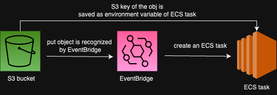

# Passing S3 PutObject event data to ECS task

# Scenario
EventBridge listens to S3 PutObject event when a file is uploaded to S3. This EventBridge rule triggers and starts a new ECS task and passes the s3 key(i.e. filename path) to the ECS task as an environment variable. 

# Prerequisites
* EventBridge Rule has to be created first. Follow [this link](https://docs.aws.amazon.com/AmazonCloudWatch/latest/events/CloudWatch-Events-tutorial-ECS.html) to create and configure EventBridge Rule.
* AWS CloudTrail has to be created to listen to event in S3 and log.
* ECS task and S3 bucket

# How to do it
In order to pass s3 key to ECS task as an environment variable, EventBridge Rule target has to be configured. This configuration is not possible thtough AWS console. Use [put_targets](https://boto3.amazonaws.com/v1/documentation/api/latest/reference/services/events/client/put_targets.html).
See [update_ecs_task.py](https://github.com/mie-h/passing-event-data-ecs-task/blob/main/update_ecs_task.py) for more detail.

# Things I learned
It is very helpful to check CloudTrail logs for debugging.

# Acknowledgments
* [Run an Amazon ECS Task When a File is Uploaded to an Amazon S3 Bucket](https://docs.aws.amazon.com/AmazonCloudWatch/latest/events/CloudWatch-Events-tutorial-ECS.html)
* [repost.aws](https://repost.aws/questions/QUtllxTXjgRCeBMmy4MzgNpQ/how-to-convince-eventbridge-to-pass-s3-event-information-to-an-ecs-target)
* [put_targets on Boto3 doc](https://boto3.amazonaws.com/v1/documentation/api/latest/reference/services/events/client/put_targets.html)
* [Passing event data to AWS ECS Task](https://www.linkedin.com/pulse/passing-event-data-aws-ecs-task-roshan-shetty/)
